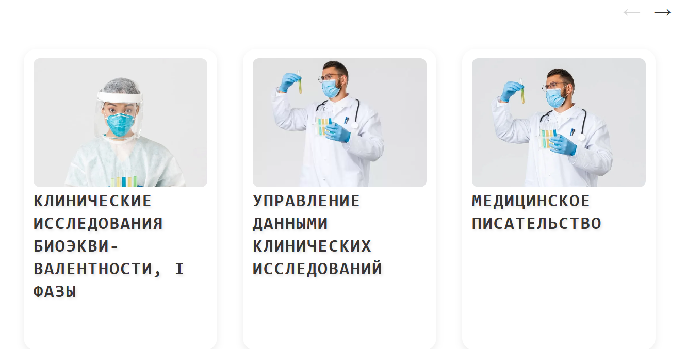
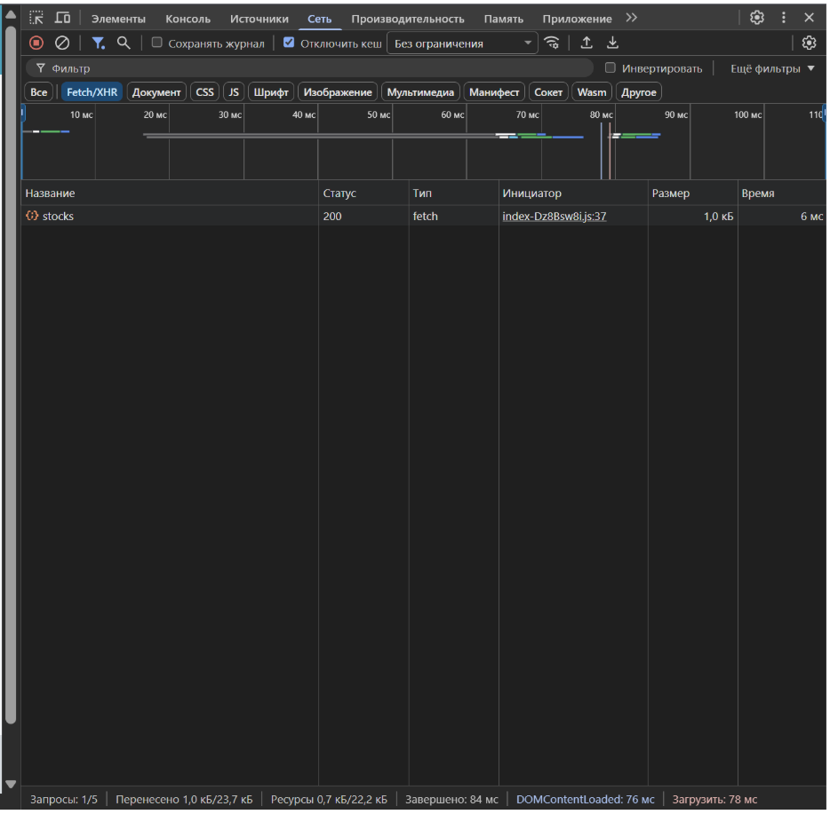

# Лабораторная работа 6: Знакомство с promise и fetch, борка клиентской части.
# Содержание

* [Цель работы](#цель-работы)
* [Задание](#задание)
    * [Основное задание](#основное-задание)
    * [Дополнительное задание](#дополнительное-задание)

## Цель работы
* Первая часть данной лабораторной работы заключается в изменении механизма взаимодействия с внешним API: в прошлой лабораторной работе использовался XMLHttpRequest, в этой - современный метод fetch. В ходе выполнения работы предстоит познакомиться с кратким полезным теоретическим материалом, кодом реализации простого взаимодействия с внешним API, получением данных и выводом их в интерфейс пользователя, и выполнить задания по варианту.
* Вторая часть лабораторной работы заключается в сборке клиентской части приложения: необходимо "сбилдить" клиентскую часть (ЛР №3) с помощью системы сборки, а также добавить в серверную часть (ЛР №4) возможность раздачи клиентской части в качестве статики во избежание проблем с CORS.
## Задание
## Основное задание
Продолжение Лабораторной работы 3: добавить страницу добавления/редактирования и соответствующие кнопки, подключение к созданному API бэкенду. Запросы XHR, Cors обойти через расширение браузера CORS Unblock.

Сайт, с которого был взят дизайн: https://www.costext.com/

Меняется логика файла ajax.js, добавляется vite.config.js и папка сборки проекта public
Структура проекта:

```
/index.html
/css/main.css
/components/
  /footer/index.js/
  /header/index.js/
  /product-card/index.js
/pages/
  /author/index.js/
  /product/index.js/
  /calc/index.js/
  /main/index.js/
  /sms/index.js/
/modules/
  /ajax.js/
  /stockUrls.js/
/my-api-service/
    /public/
        /assets/
            /index-C4EObNYF.css/
            /index-Dz8Bsw8i.js/
        /index.html/
    /src/
        /controllers/stocksControllers.js/
        /data/stocks.json/
        /routes/stocks.js/
        /services/fileService.js
        /services/stocksService.js
        /index.js/
    /package-lock.json/
    /package.json/
/index.html/
/main.js/
/package-lock.json/
```

ajax.js
```js
class Ajax {
    async get(url) {
        try {
            const response = await fetch(url);
            if (!response.ok) throw new Error(`Ошибка HTTP: ${response.status}`);
            return await response.json();
        } catch (error) {
            console.error('Ошибка GET:', error);
            return null;
        }
    }

    async post(url, data) {
        try {
            const response = await fetch(url, {
                method: 'POST',
                headers: { 'Content-Type': 'application/json' },
                body: JSON.stringify(data)
            });
            if (!response.ok) throw new Error(`Ошибка HTTP: ${response.status}`);
            return await response.json();
        } catch (error) {
            console.error('Ошибка POST:', error);
            return null;
        }
    }

    async patch(url, data) {
        try {
            const response = await fetch(url, {
                method: 'PATCH',
                headers: { 'Content-Type': 'application/json' },
                body: JSON.stringify(data)
            });
            if (!response.ok) throw new Error(`Ошибка HTTP: ${response.status}`);
            return await response.json();
        } catch (error) {
            console.error('Ошибка PATCH:', error);
            return null;
        }
    }

    async delete(url) {
        try {
            const response = await fetch(url, { method: 'DELETE' });
            if (!response.ok) throw new Error(`Ошибка HTTP: ${response.status}`);
            return await response.json();
        } catch (error) {
            console.error('Ошибка DELETE:', error);
            return null;
        }
    }
}

export const ajax = new Ajax();

```

Теперь после редактирования карточки можно сохранить изменения
```js
import * as THREE from 'three';
import { OrbitControls } from 'three/examples/jsm/controls/OrbitControls.js';
import { GLTFLoader } from 'three/examples/jsm/loaders/GLTFLoader.js';

export class ProductComponent {
    constructor(parent) {
        this.parent = parent;
    }

    getHTML(data) {
        return `
            <div class="product-detail-card" style="display: flex; flex-direction: column; align-items: center;">
                <div id="model-3d-container" style="width: 100%; height: 500px; background: #f0f4f8; border-radius: 20px; position: relative;">
                    <div id="loader-status" style="position: absolute; top: 50%; left: 50%; transform: translate(-50%, -50%);">Загрузка модели...</div>
                </div>
                <div class="product-info" style="padding: 20px; text-align: center;">
                    <h2>${data.title}</h2>
                    <p>${data.text}</p>
                </div>
            </div>
        `;
    }

    initThree(modelPath) {
        const container = document.getElementById('model-3d-container');
        const scene = new THREE.Scene();
        scene.background = new THREE.Color(0xf0f4f8);

        const camera = new THREE.PerspectiveCamera(45, container.clientWidth / container.clientHeight, 0.1, 1000);
        camera.position.set(0, 2, 5);

        const renderer = new THREE.WebGLRenderer({ antialias: true });
        renderer.setSize(container.clientWidth, container.clientHeight);
        renderer.setPixelRatio(window.devicePixelRatio);
        container.appendChild(renderer.domElement);

        const controls = new OrbitControls(camera, renderer.domElement);
        controls.enableDamping = true;

        scene.add(new THREE.AmbientLight(0xffffff, 1.2));
        const sun = new THREE.DirectionalLight(0xffffff, 1);
        sun.position.set(5, 10, 7);
        scene.add(sun);

        const loader = new GLTFLoader();
        loader.load(modelPath, (gltf) => {
            const model = gltf.scene;
            const box = new THREE.Box3().setFromObject(model);
            const center = box.getCenter(new THREE.Vector3());

            model.position.x = -center.x;
            model.position.y = -box.min.y;
            model.position.z = -center.z;

            scene.add(model);
            document.getElementById('loader-status').style.display = 'none';

            const size = box.getSize(new THREE.Vector3());
            camera.position.z = Math.max(size.x, size.y, size.z) * 2;
            controls.update();
        }, undefined, (err) => {
            document.getElementById('loader-status').textContent = "Ошибка загрузки .glb";
        });

        const animate = () => {
            requestAnimationFrame(animate);
            controls.update();
            renderer.render(scene, camera);
        };
        animate();
    }

    render(data) {
        this.parent.innerHTML = this.getHTML(data);
        if (data.modelPath) {
            this.initThree(data.modelPath);
        }
    }
}

```


Файл vite.config.js
```js
export default {
    build: {
        outDir: './public',
        emptyOutDir: true,
    },
};

```
В браузер мы отправляем fetch-запросы:



## Дополнительное задание

Ответить на теоретические вопросы преподавателя
