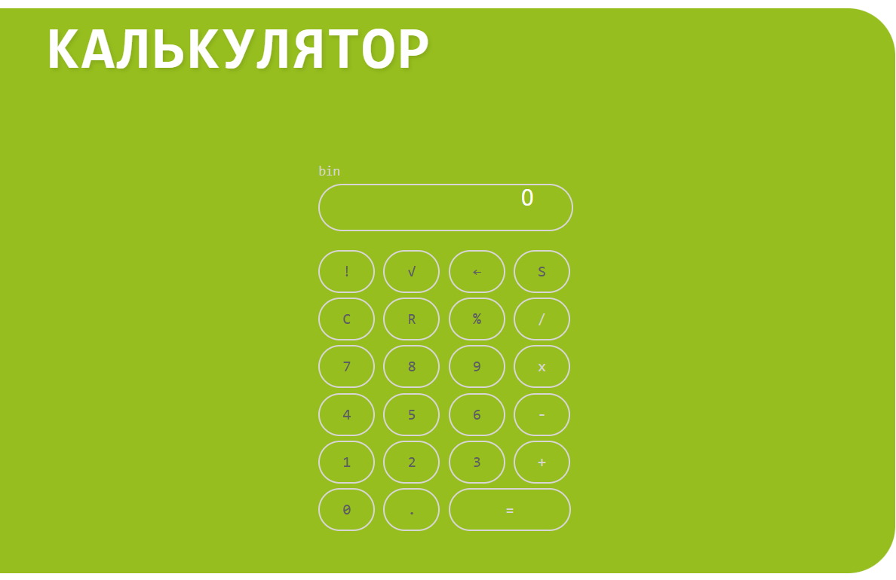

# Лабораторная работа 1: Калькулятор
# Содержание

* [Цель работы](#цель-работы)
* [Задание](#задание)
    * [Основное задание](#основное-задание)
    * [Дополнительное задание](#дополнительное-задание)

## Цель работы
Цель данной лабораторной работы - знакомство с инструментами построения пользовательских интерфейсов web-сайтов: HTML, CSS. В ходе выполнения работы, вам предстоит ознакомиться с кодом реализации простого калькулятора, и затем выполнить задания по варианту.

## Задание
## Основное задание
Задание: Создание сайта с внедрением калькулятора. Верстка на HTML, CSS.
План:
1. HTML- разметка
2. Базовая структура HTML-документа
3. Создание проекта
4. Верстка калькулятора
5. CSS
6. Применение CSS к HTML-документу
7. Стилизация верстки калькулятора с помощью CSS
Тема: Регистрация новых лекарственных препаратов

Сайт, с которого был взят дизайн: https://www.cphd.ru/ru/services/register/

## Дополнительное задание

1. Поменять цвет калькулятора на зеленый как в оригинале
```css
    .my-btn {
    width: 50px;
    height: 50px;
    border-radius: 50%;
    border: none;
    background: #515151;
    color: white;
    font-size: 1.2rem;
    cursor: pointer;
    user-select: none;

    display: flex;
    align-items: center;
    justify-content: center;
    padding: 0;
}

#btn_op_equal {
    margin-right: 5px;
    margin-top: 5px;
    width: 50px;
    height: 50px;
    border-radius: 50%;
    border: none;
    background: #7b2b2b;
    color: white;
    font-size: 1.5rem;
    font-family: Arial, Helvetica, sans-serif;
    cursor: pointer;
    user-select: none;
}

.my-btn:hover {
    background: darkgray;
}

.my-btn:active {
    filter: brightness(130%);
}

.my-btn.primary {
    background: #1079baf4;
}

.my-btn.secondary {
    background: #a6a6a6;
}

.my-btn.execute {
    width: 110px;
    border-radius: 34px;
}

.result {
    width: 220px;
    height: 60px;
    margin-bottom: 15px;
    padding: 0 15px;
    background: #494949;
    text-align: right;
    color: #ffffff;
    font-size: 2rem;
    line-height: 60px;
    border-radius: 8px;
    /* Ограничение текста */
    overflow: hidden;
    white-space: nowrap;
    text-overflow: clip;
}

h1 {
    font-family: monospace;
    color: rgba(107, 88, 88, 0.678);
    font-size: 2rem;
}

.hero {
    background-color: #ffffff;
    border-bottom: 2px solid #ffffff;
    padding: 15px 0;
    width: 100%;
}

.hero-content {
    max-width: 1200px;
    margin: 0 auto;
    padding: 0 20px;
    display: flex;
    flex-direction: column;
    gap: 20px;
}

.logo-container {
    display: flex;
    gap: 15px;
}

.logo-image {
    width: 90px;
    height: auto;
    object-fit: contain;
}

.logo-text {
    font-size: 20px;
    font-weight: bold;
    line-height: 1.2;
    color: #4e4b4b;
    text-transform: uppercase;
    letter-spacing: 1px;
    font-family: monospace;
}

.nav-links {
    display: flex;
    gap: 30px;
    margin-top: 1px;
}

.nav-button {
    text-decoration: none;
    color: #333;
    font-weight: 500;
    padding: 8px 15px;
    border-radius: 4px;
    transition: all 0.3s;
}

.nav-button:hover {
    background-color: #ffffff;
    color: #000;
}

* {
    margin: 0;
    padding: 0;
    box-sizing: border-box;
}

body {
    background-color: white;
    min-height: 100vh;
}

ц21


.calculator-title {
    font-family: monospace;
    color: #4e4b4b;
    font-size: 2rem;
    text-align: center;
    margin-bottom: 30px;
    max-width: 800px;
}

.calculator-buttons {
    display: flex;
    flex-direction: column;
    gap: 8px;
}

.button-row {
    display: flex;
    gap: 8px;
    justify-content: center;
}


